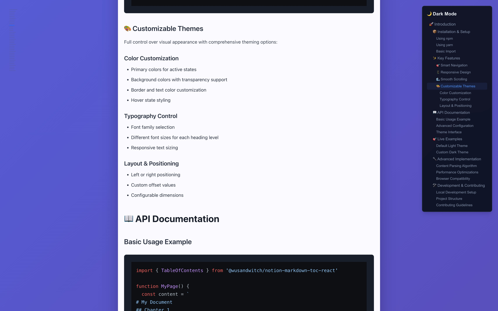

# @wusandwitch/notion-markdown-toc-react

A beautiful and customizable Table of Contents component for React, perfect for markdown content. Inspired by Notion's elegant design.

## 🎬 Demo


## Features

- 🎨 **Fully Customizable** - Colors, fonts, sizes, and positioning
- 📱 **Responsive** - Hidden on mobile, visible on large screens
- 🎯 **Smart Navigation** - Automatically highlights active sections
- ✨ **Smooth Animations** - Powered by Framer Motion
- 🔄 **Collapsible** - Hover to expand/collapse
- 🌏 **i18n Support** - Works with Chinese, English, and other languages
- 📝 **Markdown Friendly** - Automatically parses heading levels
- 🔧 **TypeScript** - Full type support

## Installation

```bash
npm install @wusandwitch/notion-markdown-toc-react framer-motion
```

```bash
yarn add @wusandwitch/notion-markdown-toc-react framer-motion
```

## 🚀 Quick Start

### Basic Usage

```tsx
import { TableOfContents } from '@wusandwitch/notion-markdown-toc-react'

function MyPage() {
  const markdownContent = `
# Introduction
This is the introduction section.

## Getting Started
Let's get started with the basics.

### Installation
Install the package using npm.

## Advanced Usage
More advanced features and configurations.
  `

  return (
    <div>
      <TableOfContents 
        content={markdownContent}
        title="Documentation"
      />
      {/* Your main content */}
    </div>
  )
}
```

### Custom Styling

```tsx
import { TableOfContents, TableOfContentsTheme } from '@wusandwitch/notion-markdown-toc-react'

const customTheme: TableOfContentsTheme = {
  primaryColor: '#8b5cf6',
  backgroundColor: 'rgba(0, 0, 0, 0.8)',
  borderColor: '#374151',
  textColor: '#f9fafb',
  mutedTextColor: '#9ca3af',
  hoverColor: '#374151',
  fontFamily: '"Inter", sans-serif',
  fontSize: {
    title: '16px',
    level1: '14px',
    level2: '13px',
    level3Plus: '12px'
  }
}

function MyPage() {
  return (
    <TableOfContents 
      content={markdownContent}
      title="Custom TOC"
      theme={customTheme}
      position="right"
      offsetTop={100}
      offsetSide={20}
    />
  )
}
```

## 📊 Live Examples

The component supports multiple themes and configurations:

| Light Theme | Dark Theme |
|-------------|------------|
|  |  |

## API Reference

### Props

| Prop | Type | Default | Description |
|------|------|---------|-------------|
| `content` | `string` | **Required** | Markdown content to parse for headings |
| `title` | `string` | **Required** | Title displayed at the top of TOC |
| `theme` | `TableOfContentsTheme` | `defaultTheme` | Custom theme configuration |
| `className` | `string` | `''` | Additional CSS classes |
| `position` | `'left' \| 'right'` | `'left'` | Position of the TOC |
| `offsetTop` | `number` | `160` | Top offset in pixels |
| `offsetSide` | `number` | `32` | Side offset in pixels |
| `maxWidth` | `number` | `280` | Maximum width when expanded |
| `minWidth` | `number` | `200` | Minimum width when expanded |

### Theme Interface

```tsx
interface TableOfContentsTheme {
  primaryColor?: string        // Main accent color
  backgroundColor?: string     // Background color of expanded TOC
  borderColor?: string        // Border color
  textColor?: string          // Primary text color
  mutedTextColor?: string     // Secondary text color
  hoverColor?: string         // Hover background color
  fontFamily?: string         // Font family
  fontSize?: {
    title?: string            // Font size for title
    level1?: string           // Font size for H1
    level2?: string           // Font size for H2
    level3Plus?: string       // Font size for H3+
  }
}
```

## Default Theme

```tsx
const defaultTheme = {
  primaryColor: '#3b82f6',
  backgroundColor: 'rgba(255, 255, 255, 0.9)',
  borderColor: '#e5e7eb',
  textColor: '#111827',
  mutedTextColor: '#6b7280',
  hoverColor: '#f3f4f6',
  fontFamily: 'system-ui, -apple-system, sans-serif',
  fontSize: {
    title: '14px',
    level1: '14px',
    level2: '13px',
    level3Plus: '12px'
  }
}
```

## Requirements

- React 16.8+
- Framer Motion 6.0+

The component uses:
- React Hooks (useState, useEffect)
- Framer Motion for animations
- TypeScript for type safety

## How It Works

1. **Content Parsing**: The component parses markdown content to extract headings (H1-H6)
2. **ID Generation**: Creates URL-friendly IDs for each heading
3. **Scroll Tracking**: Monitors scroll position to highlight active sections
4. **Smart Navigation**: Clicking TOC items smoothly scrolls to corresponding sections

The component automatically:
- Ignores headings inside code blocks
- Generates unique IDs for navigation
- Updates active states based on scroll position
- Handles responsive display (hidden on small screens)

## License

MIT

## Contributing

Contributions are welcome! Please feel free to submit a Pull Request. 